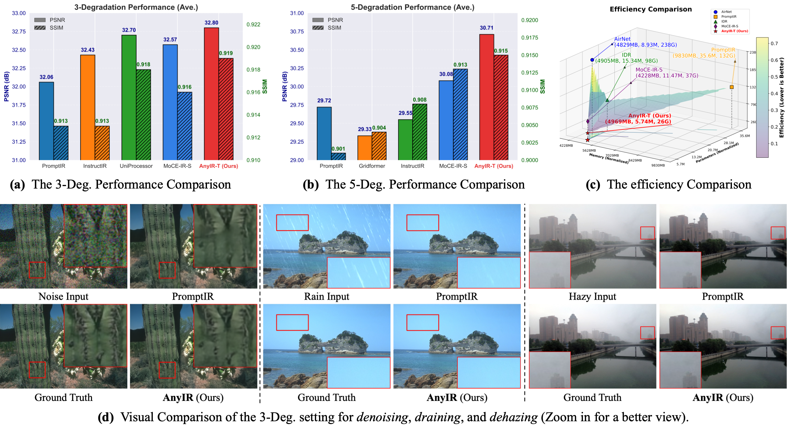
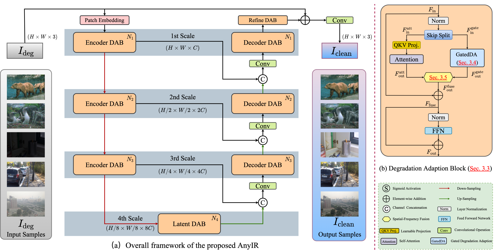

# AnyIR

<p align="center">
  <b>Any Image Restoration via Efficient Spatial-Frequency Degradation Adaptation</b><br/>
  Unified restoration for denoising, deraining, dehazing, deblurring, and low-light enhancement.
</p>

<p align="center">
  <a href="https://arxiv.org/abs/2504.14249"></a>
  <a href="https://amazingren.github.io/AnyIR/"></a>
  
  
</p>

## Overview
AnyIR is a single-model framework for **all-in-one image restoration**, designed to handle diverse degradations without training one model per task.  
The key idea is efficient spatial-frequency degradation adaptation with compact model complexity.

### Highlights
- One model for multiple restoration tasks.
- Spatial-frequency fusion for robust degradation-aware representation.
- Strong accuracy-efficiency tradeoff for practical deployment.

## Visual Overview
<p align="center">
  
</p>
<p align="center"><i>Teaser: Overall quantitative performance (3-Degradation & 5-Degradation settings), efficiency comparison, and the qualitative comparison ( Zoom in for a better view).</i></p>


## Authors
#### [Bin Ren <sup>1,2</sup>](https://amazingren.github.io/)$^\star$, [Eduard Zamfir<sup>3</sup>](https://eduardzamfir.github.io), [Zongwei Wu<sup>3</sup>](https://sites.google.com/view/zwwu/accueil)$^\dagger$, [Yawei Li<sup>4</sup>](https://yaweili.bitbucket.io/), [Yidi Li<sup>5</sup>](https://liyidi.github.io/), [Danda Pani Paudel<sup>6</sup>](https://people.ee.ethz.ch/~paudeld/), [Radu Timofte <sup>3</sup>](https://www.informatik.uni-wuerzburg.de/computervision/), [Ming-Hsuan Yang <sup>7</sup>](https://scholar.google.com/citations?user=p9-ohHsAAAAJ&hl=en), [Luc Van Gool <sup>6</sup>](https://scholar.google.com/citations?user=TwMib_QAAAAJ&hl=en), [Nicu Sebe <sup>1</sup>](https://scholar.google.com/citations?user=stFCYOAAAAAJ&hl=en)

$\star$: This work was partially conducted during the visiting stay at INSAIT. <br>
$\dagger$: Corresponding author <br>

<sup>1</sup> University of Trento, IT <br>
<sup>2</sup> Mohamed bin Zayed University of Artificial Intelligence, UAE <br>
<sup>3</sup> University of Würzburg, DE <br>
<sup>4</sup> ETH Zürich, CH <br>
<sup>5</sup> Taiyuan University of Technology, CN <br>
<sup>6</sup> INSAIT Sofia University, "St. Kliment Ohridski", BG <br>
<sup>7</sup> University of California, Merced, USA <br>

## News
- [ ] Projectpage update.
- [ ] Ckpts release.
- [ ] Main visual results release
- [x] `02/2026`: Model (i.e., code) released.
- [x] `07/2024`: Repository created.

## Method
<p align="center">
  
</p>
<p align="center"><i>(a) Framework of the proposed AnyIR: *i.e.*, a convolutional patch embedding, a U-shape encoder-decoder main body, and an extra refined block. (b) Structure of degradation adaptation block (DAB).</i></p>

<details>
  <summary><b>Abstract</b></summary>
Restoring multiple degradations efficiently via just one model has become increasingly significant and impactful, especially with the proliferation of mobile devices. Traditional solutions typically involve training dedicated models per degradation, resulting in inefficiency and redundancy. More recent approaches either introduce additional modules to learn visual prompts, significantly increasing the size of the model, or incorporate cross-modal transfer from large language models trained on vast datasets, adding complexity to the system architecture. In contrast, our approach, termed AnyIR, takes a unified path that leverages inherent similarity across various degradations to enable both efficient and comprehensive restoration through a joint embedding mechanism, without scaling up the model or relying on large language models. Specifically, we examine the sub-latent space of each input, identifying key components and reweighting them first in a gated manner.  To unify intrinsic degradation awareness with contextualized attention, we propose a spatial–frequency parallel fusion strategy that strengthens spatially informed local–global interactions and enriches restoration fidelity from the frequency domain. Comprehensive evaluations across four all-in-one restoration benchmarks demonstrate that AnyIR attains state-of-the-art performance while reducing model parameters by 84% and FLOPs by 80% relative to the baseline. These results highlight the potential of AnyIR as an effective and lightweight solution for further all-in-one image restoration. Our code is available at: https://github.com/Amazingren/AnyIR.
</details>

## Repository Layout
```text
AnyIR/
├── net/                  # model definitions (AnyIR)
├── utils/                # datasets, losses, metrics, schedulers
├── data_dir/             # dataset organization helpers
├── train.py              # training entry
├── test.py               # evaluation entry
├── train_*.sh            # training scripts
├── test_*.sh             # testing scripts
└── README.md
```

## Installation
### 1) Environment
```bash
micromamba create -n anyir python=3.9 -y
micromamba activate anyir
# or
conda create -n anyir python=3.9 -y
conda activate anyir
```

### 2) Dependencies
```bash
# NOTE: file in this repo is currently named "requiements.txt"
pip install -r requiements.txt
```

### 3) CUDA (if needed on your cluster)
```bash
export LD_LIBRARY_PATH=/opt/modules/nvidia-cuda-11.8.0/lib64:$LD_LIBRARY_PATH
export PATH=/opt/modules/nvidia-cuda-11.8.0/bin:$PATH
```

## Data Preparation
This repo supports two training/evaluation families:
- `AnyIR` (multi-task restoration benchmarks)
- `CDD11_*` subsets (combined degradation setting)

Configure dataset roots via CLI arguments in `train.py` / `test.py` (examples below).

## Training
### A) 3-degradation setting
```bash
python train.py \
  --trainset AnyIR \
  --ckpt_dir train_ckpt/3deg \
  --de_type denoise_15 denoise_25 denoise_50 derain dehaze \
  --denoise_dir /path/to/Train/Denoise \
  --derain_dir /path/to/Train/Derain \
  --dehaze_dir /path/to/Train/Dehaze \
  --gopro_dir /path/to/Train/Deblur \
  --enhance_dir /path/to/Train/Enhance \
  --num_gpus 1 \
  --batch_size 32 \
  --epochs 130 \
  --fft_loss_weight 0.1
```

### B) 5-degradation setting
```bash
python train.py \
  --trainset AnyIR \
  --ckpt_dir train_ckpt/5deg \
  --de_type denoise_15 denoise_25 denoise_50 derain dehaze deblur enhance \
  --denoise_dir /path/to/Train/Denoise \
  --derain_dir /path/to/Train/Derain \
  --dehaze_dir /path/to/Train/Dehaze \
  --gopro_dir /path/to/Train/Deblur \
  --enhance_dir /path/to/Train/Enhance \
  --num_gpus 1 \
  --batch_size 32 \
  --epochs 150 \
  --fft_loss_weight 0.1
```

### C) CDD11 setting
```bash
python train.py \
  --trainset CDD11_all \
  --ckpt_dir train_ckpt/cdd11 \
  --de_type denoise_15 denoise_25 denoise_50 derain dehaze \
  --cdd11_path /path/to/cdd11 \
  --num_gpus 1 \
  --batch_size 32 \
  --epochs 170 \
  --fft_loss_weight 0.1
```

## Evaluation
### AnyIR test suites
```bash
python test.py \
  --trainset AnyIR \
  --mode 6 \
  --denoise_path /path/to/test/denoise \
  --derain_path /path/to/test/derain \
  --dehaze_path /path/to/test/dehaze \
  --gopro_path /path/to/test/deblur \
  --enhance_path /path/to/test/enhance \
  --ckpt_name 5deg/epoch=109-step=546700.ckpt \
  --output_path ./outputs/5deg_test
```

`mode` options in `test.py`:
- `0`: denoise
- `1`: derain
- `2`: dehaze
- `3`: deblur
- `4`: enhance
- `5`: three-task setting
- `6`: full five-task setting

### CDD11 test
```bash
python test.py \
  --trainset CDD11_low_haze_rain \
  --cdd11_path /path/to/cdd11 \
  --ckpt_name cdd11/epoch=154-step=378045.ckpt \
  --output_path ./output/cdd11/test
```

## Tips
- Use the provided `train_*.sh` / `test_*.sh` as cluster templates.
- Save checkpoints under `train_ckpt/<experiment_name>/` for consistent `test.py --ckpt_name` usage.
- If you use LPIPS, add `--use_lpips` in `test.py` (slower evaluation).

## Citation
If you find this project useful, please cite:
```bibtex
@misc{ren2025any,
  title={Any Image Restoration via Efficient Spatial-Frequency Degradation Adaptation},
  author={Ren, Bin and Zamfir, Eduard and Wu, Zongwei and Li, Yawei and Li, Yidi and Paudel, Danda Pani and Timofte, Radu and Yang, Ming-Hsuan and Van Gool, Luc and Sebe, Nicu},
  year={2025},
  eprint={2504.14249},
  archivePrefix={arXiv},
  primaryClass={cs.CV}
}
```

## Acknowledgements
This work was partially supported by the FIS project GUIDANCE (Debugging Computer Vision Models via Controlled Cross-modal Generation) (No. FIS2023-03251), the Alexander von Humboldt Foundation, and the National Natural Science Foundation of China (62403345).

The code base is built on top of excellent prior work, including:
- [PromptIR](https://github.com/va1shn9v/PromptIR)
- [AirNet](https://github.com/XLearning-SCU/2022-CVPR-AirNet)
